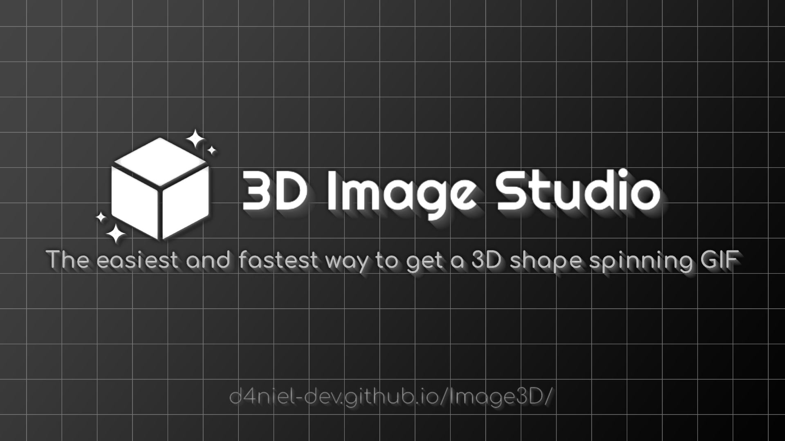

<div align="center">
  

  # Image3D Studio
  
  **Interactive 3D Texture Visualizer & Generator**
  
  [](LICENSE)
  [](https://www.typescriptlang.org/)
  [](https://threejs.org/)
  [](https://web.dev/progressive-web-apps/)

  <p align="center">
    A premium, <strong>Soft Orbital</strong> workstation for visualizing textures on 3D primitives.<br>
    Built with glassmorphism, physics-based animations, and a deep space aesthetic.
  </p>
</div>

---

## 🌌 Overview

**Image3D Studio** is a high-performance web application designed for artists and developers to instantly visualize texture maps on various 3D geometry. 

Beyond a simple viewer, it features a robust **"Soft Orbital" UI**—a translucent, glass-like interface that floats above a digital horizon. It includes advanced camera controls, real-time material editing, and is fully installable as a **Progressive Web App (PWA)** for offline creativity.

## ✨ Key Features

### 🎨 Visual & UI
- **Soft Orbital Theme**: Deep space backdrops, neon cyan accents (#00f0ff), and frosted glass panels (`backdrop-filter: blur`).
- **Smooth Animations**: Physics-based accordion menus and panel transitions.
- **Responsive Design**: "Obsidian Slate" mobile adaptation with touch-optimized gesture controls.

### 🛠 Technical Core
- **Real-time Rendering**: Powered by **Three.js** with optimized geometry and shader materials.
- **PWA Support**: Offline-first capability with Service Worker caching and standalone installability.
- **State Persistence**: Settings (camera, material, visuals) are saved automatically to local storage.
- **Error Handling**: integrated global error trapping with a neon-toast notification system.

### 🎛 Controls
- **Material Editor**: Live tweak Roughness, Metalness, Color, and Wireframe modes.
- **Camera Suite**: Auto-rotation, Turntable/Static modes, and locked angles.
- **Export**: Generate GIFs or take Snapshots of your scene instantly.
- **Drag & Drop**: Upload custom textures directly onto the model.

## 🚀 Getting Started

### Prerequisites
- Node.js (v16+)
- npm or yarn

### Installation

```bash
# Clone the repository
git clone https://github.com/yourusername/image3d-update.git

# Enter directory
cd image3d-update

# Install dependencies
npm install
```

### Development

```bash
# Run dev server with Hot Module Replacement
npm run dev

# OR use the PowerShell automation script
./dev.ps1
```

### Production Build

```bash
# Build for production (outputs to /dist)
npm run build
```

## 🏗 Architecture

- **`src/main.ts`**: Entry point, bootstraps `App` and global error handling.
- **`src/app.ts`**: Core orchestrator connecting Scene and UI.
- **`src/scene/`**: Three.js logic (`SceneManager`, `Lighting`, `Geometry`).
- **`src/ui/`**: UI components (`UIManager`, `NotificationSystem`, `BottomSheet`).
- **`src/utils/`**: Helpers (`SettingsManager`, `DeviceUtils`).
- **`src/styles/`**: CSS variables and theme definitions.

## 📦 Progressive Web App

Image3D Studio meets all PWA criteria:
- **Manifest**: Full metadata for standalone installation.
- **Service Worker**: Network-first strategy for reliable offline access and instant loading.
- **Icons**: Adaptive icon set for all devices.

## 📄 License

Distributed under the MIT License. See `LICENSE` for more information.

---

<div align="center">
  <sub>Designed & Engineered with the "Soft Orbital" Design System.</sub>
</div>
